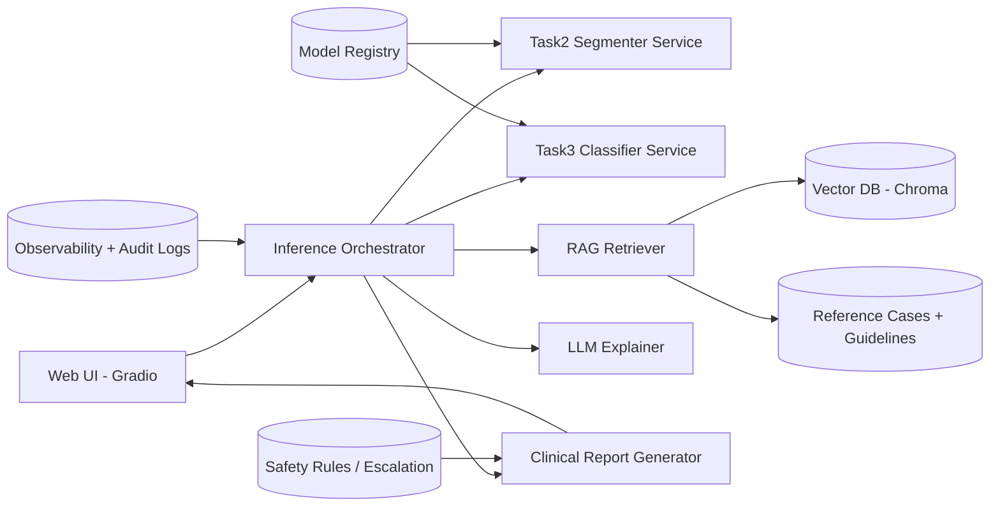
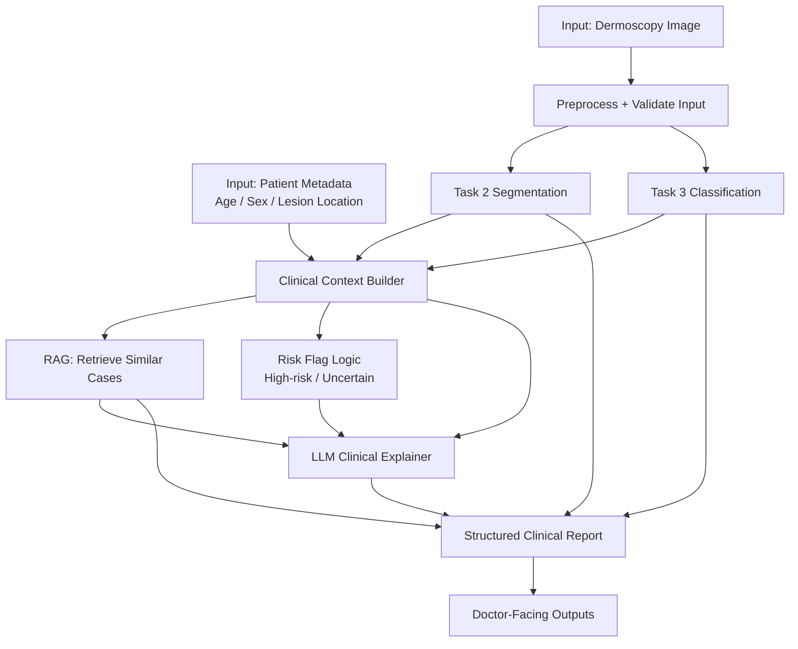

# DermAI Clinical Assistant

## Answers Organized by 5 Questions (Toggle View)

All content is grouped below into exactly 5 toggle sections (Part 1 → Part 5).

<details>
<summary><strong>Part 1 — Question Mapping (Data Exploration and Analysis)</strong></summary>

### Question 1 (Required)
Source prompt:
- Describe the dataset
- Analyze the quality of annotations, especially for dermoscopic structures
- Discuss how annotation quality may affect model behavior/performance

Primary answer file:
- [part1_data_analysis_final.md](part1_data_analysis_final.md)

Where each sub-question is answered:
- Dataset description: `Q1. Describe the Dataset`
- Annotation quality analysis: `Q2. Analyze the Quality of Annotations`
- Impact on model performance: `Q3. How Annotation Quality May Affect the Model`

</details>

<details>
<summary><strong>Part 2 — Problem Formulation & AI Design (Required)</strong></summary>

### System Scope (Implemented in this repo)
- Task 2: Dermoscopic structure segmentation
- Task 3: Lesion classification (7 classes)
- RAG: Similar reference cases retrieval
- LLM: Clinical interpretation support

### Ideal Architecture (Target)


### End-to-End Clinical Flow (Image + Patient Info)


### 1) AI task formulation
- Implemented tasks in this project:
  - **Task 2: segmentation** of 5 dermoscopic structures (`pigment_network`, `negative_network`, `streaks`, `milia_like_cyst`, `globules`)
  - **Task 3: classification** of 7 disease classes (`MEL`, `NV`, `BCC`, `AKIEC`, `BKL`, `DF`, `VASC`)
- System design used in code: **multi-stage/hybrid**
  - run Task 2 and Task 3 separately
  - fuse outputs in context builder
  - retrieve similar cases (RAG)
  - generate clinician-facing explanation

### 2) Model architectures considered and rationale
- **Task 2 model used**: `TransUNet (R50-ViT-B_16)` (notebook implementation)
- **Task 3 models used**:
  - `efficientnet_v2_s` (2 runs: `exp_000`, `exp_003`)
  - `efficientnet_v2_l` (`exp_001`)
  - `swin_v2_b` (`exp_002`)
  - calibrated ensemble over the 4 checkpoints for better balanced accuracy
- Why these models:
  - segmentation needs both local detail and global context
  - classification benefits from strong CNN/Transformer backbones and ensemble robustness on imbalanced classes

Details of training setup, hyperparameters, and metrics are documented in notebooks:
- Task 3: https://www.kaggle.com/code/dinhnhatky/isic-018-task3-training
- Task 2: https://www.kaggle.com/code/dinhnhatky2003/isic-2018-task2-transunet-512-640

Evidence from executed experiments (to justify design choices):
- Task 3 quantitative evidence: see `Experiment Results (Task 3)` section in this README.
- Task 2 quantitative evidence: see `Experiment Results (Task 2)` section in this README.
- Rationale-to-result linkage:
  - Ensemble choice is supported by higher balanced accuracy vs single models.
  - Segmentation difficulty on tiny structures is reflected in lower per-attribute Jaccard.

### 3) Handling noisy or incomplete annotations
- In Task 3 training/evaluation flow, both `CE` and `WCE` were used in different runs; `WCE` is the imbalance-aware option in the provided setup.
- In the deployed pipeline, outputs are not treated as hard labels only:
  - Task 2 keeps per-structure confidence/coverage
  - Task 3 keeps top-k probabilities and uncertainty flags
- In RAG, reference cases are enriched with:
  - `diagnosis_confirm_type`
  - `evidence_weight`
  to prioritize stronger evidence when presenting similar cases.

### 4) Multi-task learning strategy (if applicable)
- Current implementation is **not joint multi-task training** in one network.
- Current implementation is **decoupled multi-stage inference**:
  - Task2 model and Task3 model are trained/loaded separately
  - outputs are fused at context/RAG/report level
- This is the actual approach implemented in this repository.

### 5) Generalization to real-world dermoscopic images
- Current evidence is based on ISIC 2018 setup and checkpoints.
- For real-world deployment, additional external validation is still required:
  - different devices/centers
  - different acquisition conditions
  - calibration monitoring for uncertainty and risk flags
- Therefore, current system should be used as **clinical decision support**, not autonomous diagnosis.

### Current Status
- UI pipeline is integrated end-to-end.
- Task2/Task3 support mock + real checkpoint loading.
- RAG uses curated JSON knowledge base + Chroma retrieval.
- LLM explanation supports API-based generation with fallback.

### Real Inference Contract
- Task 2 input: RGB image -> 5-channel structure output.
- Task 3 input: RGB image -> 7-class logits/probabilities.

### Environment and Run (Demo)
- Configure model/API settings in `.env`.
- Run:
```bash
python3 -m venv .venv
source .venv/bin/activate
pip install -r requirements.txt
python app.py
```

### Supporting Detail — Knowledge Base Architecture (Clinical-Focused)

#### Why KB matters for doctors
- The system should not only output a prediction score.
- It should retrieve **comparable reference cases** with evidence quality, so clinicians can verify AI suggestions.
- This repository now uses a case-based KB designed for clinical decision support.

#### KB storage design
- Primary KB file: [`data/reference_cases/isic_reference_cases.json`](data/reference_cases/isic_reference_cases.json)
- Vector index: `data/chroma_db/`
- Runtime loader/enricher: [`rag/reference_data.py`](rag/reference_data.py)

Each reference case is normalized to a medical-friendly schema:

```json
{
  "case_id": "ref_mel_001",
  "diagnosis": "MEL",
  "diagnosis_confirm_type": "histopathology",
  "evidence_weight": 1.0,
  "task2_features": {
    "pigment_network": {"present": true, "coverage_pct": 12.5, "confidence": 0.82},
    "streaks": {"present": true, "coverage_pct": 3.2, "confidence": 0.61},
    "negative_network": {"present": false, "coverage_pct": 0.0, "confidence": 0.0},
    "milia_like_cyst": {"present": false, "coverage_pct": 0.0, "confidence": 0.0},
    "globules": {"present": false, "coverage_pct": 0.0, "confidence": 0.0}
  },
  "rule_tags": ["melanocytic_pattern", "high_risk_growth", "high_risk"],
  "clinical_text": "..."
}
```

#### Dual-axis indexing strategy
The KB is indexed along two clinical axes:
1. **Disease axis (Task 3)**
- `diagnosis` (`MEL`, `NV`, `BCC`, `AKIEC`, `BKL`, `DF`, `VASC`)
- `diagnosis_confirm_type` and `evidence_weight` (trust hierarchy)
2. **Dermoscopic structure axis (Task 2)**
- `task2_features` for 5 labels: `pigment_network`, `negative_network`, `streaks`, `milia_like_cyst`, `globules`
- Each feature stores `present`, `coverage_pct`, `confidence`.

#### Retrieval flow at inference time
1. Task 2 returns `task2_features`.
2. Task 3 returns top diagnosis + confidence.
3. `context_builder` creates `risk_flags`, `rule_tags`, `search_query/context_text`.
4. Chroma semantic retrieval runs on `clinical_text` embeddings.
5. Clinical re-ranking applies diagnosis/structure/rule/evidence bonuses.
6. Top similar cases are passed to LLM + report generator.

</details>

<details>
<summary><strong>Part 3 — Clinical Visualization & User Experience (Required)</strong></summary>

This repository’s current UI/flow is designed around clinician-facing decision support (not autonomous diagnosis).

### 1) What information is shown to dermatologists
- **Structural output (Task 2)**
  - segmentation overlays for 5 dermoscopic structures
  - per-structure `present`, `coverage_pct`, `confidence`
- **Classification output (Task 3)**
  - primary diagnosis + confidence
  - top-k differential with risk level
- **Clinical context**
  - uncertainty/risk flags (e.g., high-risk diagnosis, low-confidence cases)
  - rule tags derived from Task2 + Task3 fusion
- **RAG evidence**
  - similar reference cases
  - evidence metadata (`diagnosis_confirm_type`, `evidence_weight`)
- **Narrative support**
  - structured LLM interpretation + report with disclaimer

### 2) How this supports clinical decision-making
- Provides a **traceable chain** from image evidence (structures) to diagnostic suggestion (top-k classes).
- Adds **comparable reference cases** to reduce black-box effect.
- Surfaces **uncertainty explicitly** so borderline cases are escalated for careful review.
- Supports documentation via structured report output.

### 3) How this complements classification results
- Classification alone gives probability ranking.
- Segmentation + structure metrics explain *why* a class is plausible.
- RAG adds precedent-style context (“similar known cases with evidence quality”).
- LLM converts fused outputs into clinician-readable interpretation/checklist.

### 4) What not to show (to avoid misleading clinicians)
- Do **not** show a single diagnosis as definitive truth.
- Do **not** hide uncertainty or confidence gaps between top classes.
- Do **not** present low-quality retrieved cases without evidence labeling.
- Do **not** use aggressive wording that implies autonomous medical decision.

### 5) Mockups / diagrams in this README
- `Ideal Architecture (Target)` diagram
- `End-to-End Clinical Flow (Image + Patient Info)` diagram
- `Knowledge Base Architecture (Clinical-Focused)` section for retrieval + evidence flow

</details>

<details>
<summary><strong>Part 4 — Experiments & Results (Required)</strong></summary>

This section lists only experiments that were actually run and logged in this project/notebooks.

### 1) Experimental setups that were run
- **Task 3 (classification)**
  - Models: `efficientnet_v2_s` (`exp_000`, `exp_003`), `efficientnet_v2_l` (`exp_001`), `swin_v2_b` (`exp_002`)
  - Strategy: single-model evaluation + calibrated 4-model ensemble
  - Loss/training config (from training setup): `WCE` (weighted cross-entropy), AdamW, label smoothing, mixup
  - Metrics: AUC, AP, Sensitivity, Specificity, Dice, PPV, NPV, Balanced Multiclass Accuracy
- **Task 2 (structure segmentation)**
  - Model: `TransUNet (R50-ViT-B_16)`
  - Metric: Jaccard / mIoU per structure + mean Jaccard

### 2) Quantitative results reported
- Task 3 single-model and ensemble numbers are documented in:
  - `Supporting Detail — Experiment Results (Task 3)` below
- Task 2 quantitative numbers are documented in:
  - `Supporting Detail — Experiment Results (Task 2)` below

### 3) Qualitative examples (visualizations)
- Task 3:
  - ROC curves saved during evaluation (see logged output paths in experiment section)
- Task 2:
  - Segmentation overlays and per-structure outputs shown in Gradio app
  - Notebook includes qualitative mask visualization workflow

### 4) Failure cases and limitations (observed)
- Task 3:
  - Lower recall in minority/harder classes (e.g., `AKIEC`, `DF`, some `MEL` confusion with `NV/BKL`)
  - Even with high AUC, balanced accuracy is notably lower than overall accuracy (class imbalance effect)
- Task 2:
  - Lower Jaccard on sparse/tiny structures (`streaks`, `milia_like_cyst`, `globules`)
  - Performance sensitive to annotation sparsity and structure scale
- System-level limitations:
  - Current KB is small curated JSON for demo
  - Generalization to unseen centers/devices still requires external validation

### 5) Impact of annotation noise on results
- Annotation quality discussion is provided in:
  - [part1_data_analysis_final.md](part1_data_analysis_final.md)
- Key observed impact in experiments:
  - noisy/ambiguous structure labels reduce segmentation ceiling
  - class imbalance + label uncertainty reduce minority-class recall and balanced metrics

### Supporting Detail — Experiment Results (Task 3)

#### Setup
- Dataset: ISIC 2018 Task 3 test set (`N=1512`)
- Metric focus: `Balanced Multiclass Accuracy` (MRC/BACC)
- GPU: `CUDA_VISIBLE_DEVICES=0,1`
- Seed: `47`
- Source of numbers: executed run logs / notebook outputs reported in this project documentation.

#### Training Notebook (Task 3)
- Kaggle Notebook: `isic-018-task3-training`
- Link: https://www.kaggle.com/code/dinhnhatky/isic-018-task3-training

#### Single Model Results
| Experiment | Backbone | Training Run | Epoch | Val MCR | Mean AUC | Mean Sensitivity | Mean Dice | Mean PPV | Balanced Accuracy |
|---|---|---|---:|---:|---:|---:|---:|---:|---:|
| `exp_000` | `efficientnet_v2_s` | Run #1 | 32 | 0.8573 | 0.953 | 0.705 | 0.731 | 0.777 | **0.705** |
| `exp_001` | `efficientnet_v2_l` | Run #1 | 50 | 0.8610 | 0.962 | 0.727 | 0.759 | 0.807 | **0.727** |
| `exp_002` | `swin_v2_b` | Run #1 | 38 | 0.8644 | 0.941 | 0.721 | 0.736 | 0.774 | **0.721** |
| `exp_003` | `efficientnet_v2_s` | Run #2 | 12 | 0.8804 | 0.965 | 0.746 | 0.758 | 0.780 | **0.746** |

#### Calibrated Ensemble (4 Models)
- Members: `exp_000`, `exp_001`, `exp_002`, `exp_003`
- Tuned weights: `[0.1156, 0.2751, 0.0904, 0.5190]`
- Class bias: `[0.1001, 0.0760, 0.1431, 0.4700, 0.2007, 0.0, 0.0]`
- **Balanced Multiclass Accuracy: 0.770**
- Mean Sensitivity: `0.770`
- Mean AUC: `0.974`

#### Summary
- Best single model: `exp_003` (`BACC=0.746`)
- Calibrated ensemble improves to `BACC=0.770` (**+0.024 absolute**)
- Biggest remaining confusion is mainly among `MEL`, `NV`, and `BKL`

### Supporting Detail — Experiment Results (Task 2)

#### Training Notebook (Task 2)
- Kaggle Notebook: `isic-2018-task2-transunet-512-640`
- Link: https://www.kaggle.com/code/dinhnhatky2003/isic-2018-task2-transunet-512-640

#### Test Results (Jaccard / IoU)
| Attribute | Jaccard (IoU) |
|---|---:|
| `pigment_network` | 0.5035 |
| `negative_network` | 0.2999 |
| `streaks` | 0.1818 |
| `milia_like_cyst` | 0.1429 |
| `globules` | 0.1850 |
| **Mean Jaccard (mIoU)** | **0.2626** |

</details>

<details>
<summary><strong>Part 5 — Critical Thinking & Future Work (Optional but Strong Plus)</strong></summary>

This repository is a **working demo**, built in a short timeline, and is not yet a production-grade clinical system.

### 1) If more unlabeled data is available
- Add semi-supervised learning for Task 2/Task 3:
  - pseudo-labeling with confidence filtering
  - consistency regularization across augmentations
- Use large unlabeled dermoscopy pools to improve feature robustness and reduce overfitting to ISIC-style distributions.

### 2) If weak labels / clinician feedback can be collected
- Add a feedback loop:
  - clinicians mark agreement/disagreement with AI outputs
  - corrections are stored as weak labels with provenance
- Prioritize active learning:
  - send uncertain/high-disagreement cases for expert review first
- Update KB with clinician-validated cases and stronger evidence weighting.

### 3) Clinical validation (not only technical validation)
- Perform external validation on data from new centers/devices.
- Evaluate clinician-facing outcomes, not just model metrics:
  - sensitivity for high-risk lesions
  - calibration and uncertainty reliability
  - decision impact in reader studies (with vs without AI support)
- Run prospective pilot with audit trail and safety escalation policy.

### 4) Deployment risks
- False reassurance from confident but wrong predictions.
- Over-reliance on AI in ambiguous cases if uncertainty is not emphasized.
- Domain shift across device types, acquisition protocols, and patient populations.
- Annotation noise propagating into model and retrieval outputs.
- Privacy/governance risks if data logging is not tightly controlled.

### 5) Near-term roadmap
- Expand KB from curated demo cases to real case exports with confirmation metadata.
- Improve calibration and uncertainty handling for Task 3.
- Improve tiny-structure recall for Task 2.
- Add stricter clinical guardrails in UI/report language.

### Delivery Plan (Practical)
1. Demo-ready integration with stable UX flow
2. Model quality iteration (evaluation + calibration)
3. Clinical data layer expansion and provenance
4. Safety/governance hardening (audit + escalation)
5. Optional service split for scaling

### Definition of Done (Current Repo Phase)
- App runs locally without manual code edits.
- Real weights configurable via `.env`.
- Missing weights do not crash the app (fallback remains available).
- Output format remains stable for UI, RAG, and reporting.

</details>
