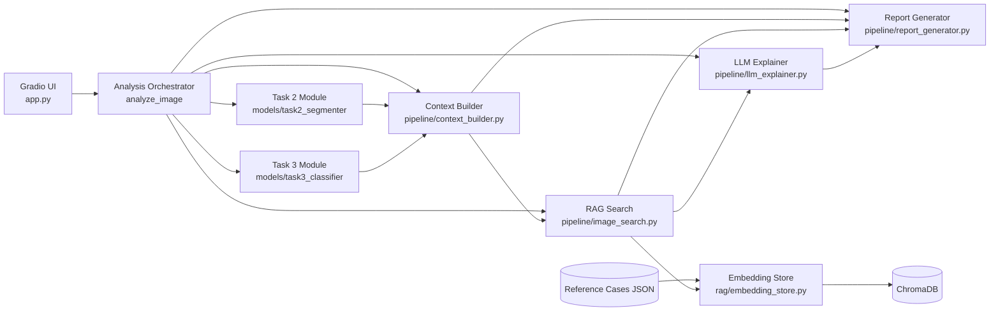
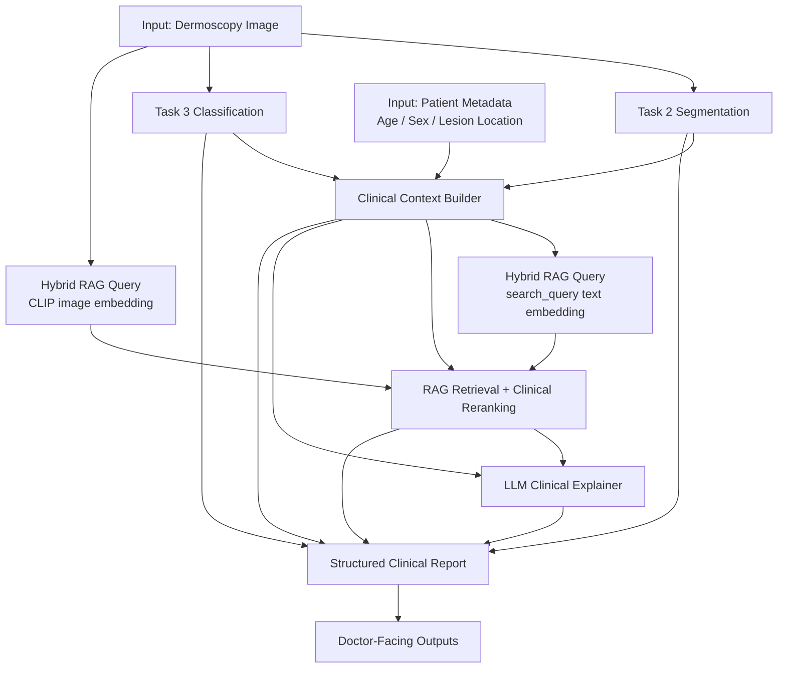
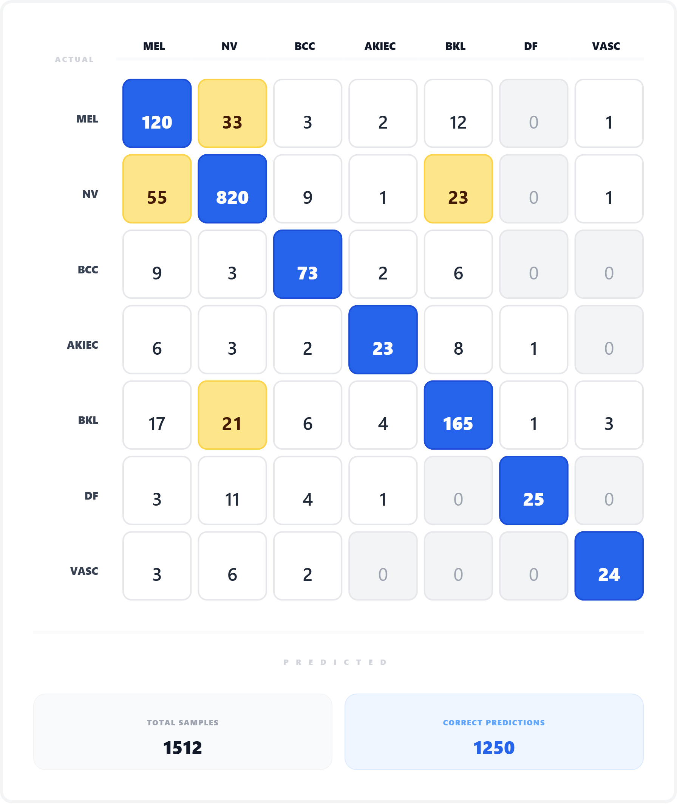
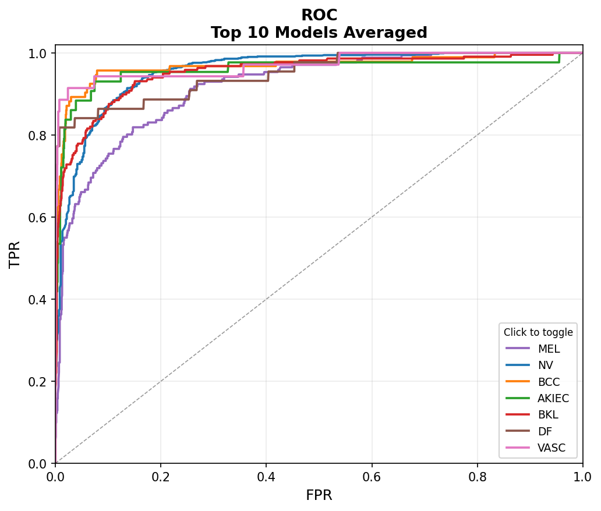
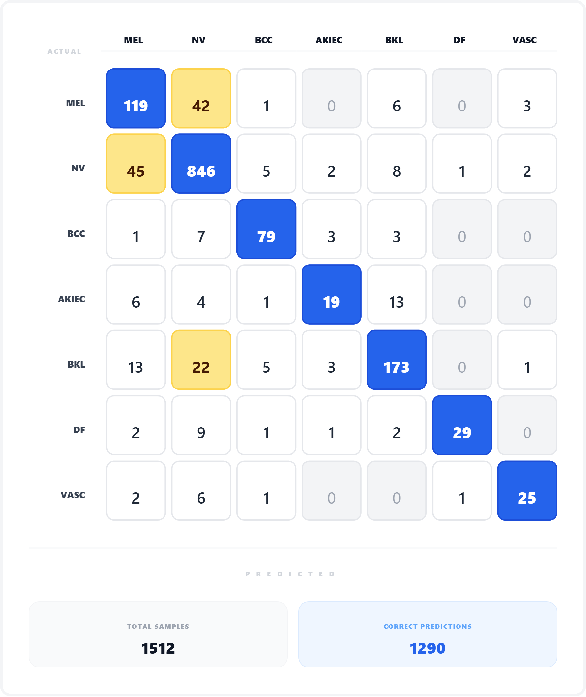
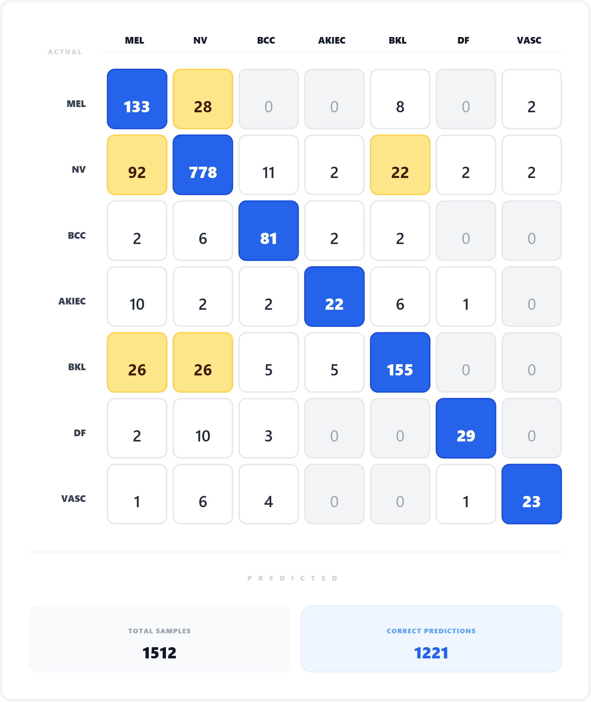
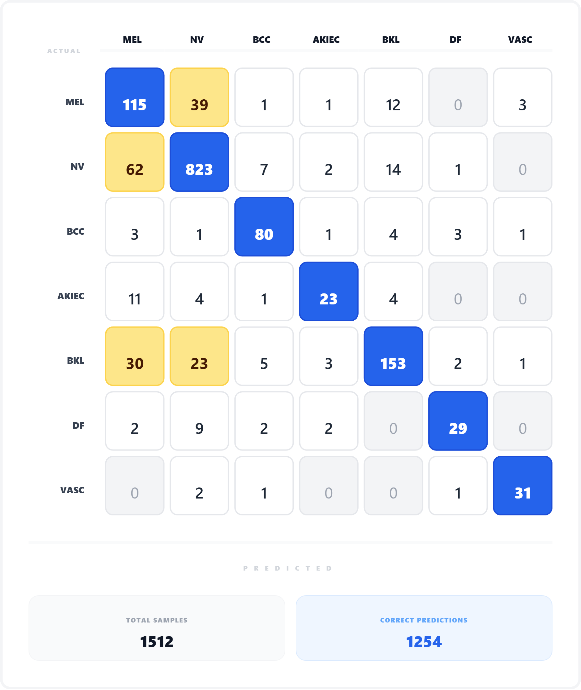
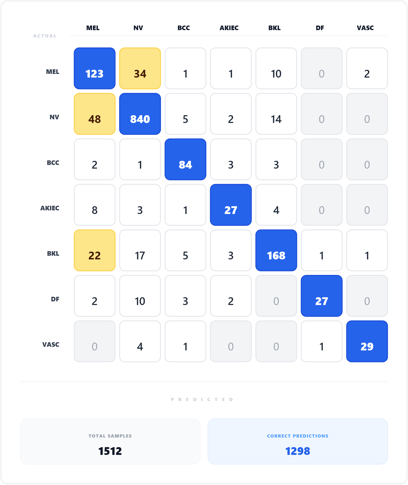

# DermAI Clinical Assistant

> AI-powered clinical decision support for dermoscopy image analysis.
> Designed for dermatologists — not autonomous diagnosis.

---

## Table of Contents

- [Quick Start](#quick-start)
- [Part 1 — Data Exploration and Analysis](#part-1--data-exploration-and-analysis)
- [Part 2 — Problem Formulation & AI Design](#part-2--problem-formulation--ai-design)
- [Part 3 — Clinical Visualization & User Experience](#part-3--clinical-visualization--user-experience)
- [Part 4 — Experiments & Results](#part-4--experiments--results)
- [Part 5 — Critical Thinking & Future Work](#part-5--critical-thinking--future-work)

---

## Quick Start

Live demo: http://34.143.254.132:7860/

Configure model/API settings in `.env`, then run:

```bash
python3 -m venv .venv
source .venv/bin/activate
pip install -r requirements.txt
python app.py
```

<details>
<summary><strong>Part 1 — Data Exploration and Analysis</strong></summary>

<br>

**Question 1**

In this session, we addressed these Part 1 questions:
- Describe the dataset
- Analyze the quality of annotations, especially for dermoscopic structures
- Discuss how annotation quality may affect model behavior/performance

View detail in: [part1_data_analysis_final.md](part1_data_analysis_final.md)


</details>

---

<details>
<summary><strong>Part 2 — Problem Formulation & AI Design</strong></summary>

<br>

### System Scope

Given limited project time, this implementation focuses on **Task 2** and **Task 3** only.
These two tasks were prioritized because they provide the most direct clinician-facing value in this demo:
- Task 2 provides structural evidence (what patterns are present and where).
- Task 3 provides differential diagnosis probabilities (what disease class is most likely).

Due to the same time constraint, model exploration was intentionally narrow and limited to a small set of practical baselines/checkpoints that could be trained, evaluated, and integrated end-to-end in one pipeline.

- Task 2: Dermoscopic structure segmentation
- Task 3: Lesion classification (7 classes)

### 1) AI Task Formulation

Implemented tasks in this project:
- **Task 2: segmentation** of 5 dermoscopic structures (`pigment_network`, `negative_network`, `streaks`, `milia_like_cyst`, `globules`)
- **Task 3: classification** of 7 disease classes (`MEL`, `NV`, `BCC`, `AKIEC`, `BKL`, `DF`, `VASC`)

- Fuse both outputs in a downstream clinical context layer
- Integrate RAG retrieval over a curated knowledge base and use an LLM to generate clinician-facing explanations, differential context, and verification cues for doctor review.

### 2) Model Architectures Considered and Rationale

| Task | Model | Notes |
|------|-------|-------|
| Task 2 | `TransUNet (R50-ViT-B_16)` | 5-attribute segmentation |
| Task 3 | `efficientnet_v2_s` | 2 runs: `exp_000`, `exp_003` |
| Task 3 | `efficientnet_v2_l` | `exp_001` |
| Task 3 | `swin_v2_b` | `exp_002` |
| Task 3 | Calibrated ensemble | Over all 4 checkpoints |

Why these models:

General reasons for medical / dermoscopy data

- Limited data availability — medical datasets are typically small, making pre-trained weights (ImageNet / ImageNet-21k) critical for effective transfer learning rather than training from scratch.
- Severe class imbalance — ISIC 2018 Task 3 is well-known for its skewed label distribution across lesion types. Selecting architecturally diverse backbones allows a direct comparison of which family is more robust toward minority classes, rather than simply optimizing overall accuracy.


- **Task 2 (`TransUNet R50-ViT-B_16`)**
  - TransUNet combines CNN feature extraction (ResNet-50) with Transformer context modeling, which is suitable for dermoscopy attributes that include both tiny local patterns and broader spatial arrangement.
  - Segmentation in medical imaging requires both fine detail and global context — lesion boundaries in dermoscopy are often irregular and poorly defined. The Transformer branch allows the model to attend to long-range spatial dependencies that a pure CNN with a limited receptive field would miss.
  - ViT pre-trained on ImageNet-21k provides stronger feature representations when fine-tuning on a relatively small domain-specific dataset like ISIC.

- **Task 3 (`efficientnet_v2_s`, `efficientnet_v2_l`, `swin_v2_b`)**
  - `efficientnet_v2_s`: lighter and practical for repeated runs/ablation under limited time; two independent runs were kept (`exp_000`, `exp_003`).
  - `efficientnet_v2_l`: larger-capacity EfficientNet variant to test whether scaling model capacity improves minority-class behavior.
  - `swin_v2_b`: window-based Transformer backbone with a different inductive bias than CNN-only families, used to add architectural diversity.
  - Complementary inductive biases — CNNs assume locality and translation equivariance, which aligns well with texture and colour patterns in skin lesions. Transformers impose fewer spatial priors and learn relational structure more flexibly. Using both families makes any ensemble more diverse and makes architectural comparisons more informative.
  - Capacity ablation within the same family — comparing efficientnet_v2_s and efficientnet_v2_l directly tests whether scaling model capacity is beneficial on this specific dataset. In medical imaging, larger models do not always generalise better due to the risk of overfitting on small, imbalanced corpora — making this a practically motivated design choice rather than a purely empirical one.
- **Why not only one model**
  - The three backbones provide complementary error patterns (CNN family + Transformer family, plus different capacities), so calibrated ensembling was tested.
  - In executed results, this choice was justified empirically: calibrated ensemble BACC `0.770` > best single model BACC `0.746` (`exp_003`).

Training notebooks:
- Task 3: https://www.kaggle.com/code/dinhnhatky/isic-018-task3-training
- Task 3 weights: https://www.kaggle.com/models/dinhnhatky/isic-task3-weights/
- Task 2: https://www.kaggle.com/code/dinhnhatky2003/isic-2018-task2-transunet-512-640
- Task 2 weights: https://www.kaggle.com/models/dinhnhatky2003/isic-2018-task2-weight/


### 3) Handling Noisy or Incomplete Annotations

- In Task 3, the training pipeline supports both `CE` and `WCE` (configurable).
- Task 3 setup also uses regularization (`label_smoothing=0.1`, `mixup_alpha=0.4`) to reduce overconfidence and improve minority-class behavior
- In deployment/inference, outputs are preserved as probabilistic evidence (not hard labels only):
  - Task 2 keeps per-structure confidence/coverage
  - Task 3 keeps top-k probabilities and uncertainty flags

### 4) Multi-task Learning Strategy (if applicable)

- Current implementation is **not joint multi-task training** in one network
- Current implementation is **decoupled multi-stage inference**:
  - Task 2 model and Task 3 model are trained/loaded separately
  - Outputs are fused in a downstream context layer
- This is the actual approach implemented in this repository

### 5) Generalization to Real-World Dermoscopic Images

- Current evidence is based on ISIC 2018 setup and checkpoints
- For real-world deployment, additional external validation is still required:
  - Different devices/centers
  - Different acquisition conditions
  - Calibration monitoring for uncertainty and risk flags
- Therefore, current system should be used as **clinical decision support**, not autonomous diagnosis

</details>

---

<details>
<summary><strong>Part 3 — Clinical Visualization & User Experience</strong></summary>

<br>

> This repository's current UI/flow is designed around clinician-facing decision support (not autonomous diagnosis).

### 1) Current System Architecture



### 2) End-to-End Clinical Flow (Image + Patient Info)



### 3) Clinician-Facing Design

#### 3.1) What Information is Shown to Dermatologists

- **Structural output (Task 2)**
  - Segmentation overlays for 5 dermoscopic structures
  - Per-structure `present`, `coverage_pct`, `confidence`
- **Classification output (Task 3)**
  - Primary diagnosis + confidence
  - Top-k differential with risk level
- **Clinical context**
  - Uncertainty/risk flags from rule-based logic (e.g., high-risk diagnosis, low-confidence cases, structure-diagnosis conflicts)
  - Rule tags derived from Task 2 + Task 3 fusion
- **RAG evidence**
  - Similar reference cases
  - Evidence metadata (`diagnosis_confirm_type`, `evidence_weight`)
- **Narrative support**
  - Structured LLM interpretation + report with disclaimer

#### 3.2) How This Supports Clinical Decision-Making

- Provides a **traceable chain** from image evidence (structures) to diagnostic suggestion (top-k classes)
- Adds **comparable reference cases** to reduce black-box effect
- Surfaces **uncertainty explicitly** so borderline cases are escalated for careful review
- Supports documentation via structured report output

#### 3.3) How This Complements Classification Results

- Classification alone gives probability ranking
- Segmentation + structure metrics explain *why* a class is plausible
- RAG adds precedent-style context ("similar known cases with evidence quality")
- LLM converts fused outputs into clinician-readable interpretation/checklist

#### 3.4) What NOT to Show (to Avoid Misleading Clinicians)

- Do **not** show a single diagnosis as definitive truth
- Do **not** hide uncertainty or confidence gaps between top classes
- Do **not** present low-quality retrieved cases without evidence labeling
- Do **not** use aggressive wording that implies autonomous medical decision

#### 3.5) Mockups / Diagrams in This README

- `Current System Architecture` diagram
- `End-to-End Clinical Flow (Image + Patient Info)` diagram
- `Knowledge Base Architecture (Clinical-Focused)` section for retrieval + evidence flow

---

### 4) Knowledge Base Architecture (Clinical-Focused)

> **Note:** In the current demo KB, all case fields are mock/curated demo content.
> They should be replaced by real, validated clinical data before any production or clinical use.

#### 4.1) Why KB Matters for Doctors

- The system should not only output a prediction score
- It should retrieve **comparable reference cases** with evidence quality, so clinicians can verify AI suggestions
- This repository now uses a case-based KB designed for clinical decision support

#### 4.2) Reference Case Schema

Each reference case is normalized to a consistent schema for retrieval and clinical-style reporting:

```json
{
  "case_id": "ref_mel_001",
  "diagnosis": "MEL",
  "diagnosis_name": "Melanoma",
  "structures": ["pigment_network", "streaks", "globules"],
  "description": "...",
  "clinical_notes": "...",
  "source": "ISIC 2018 Training Set — HAM10000",
  "diagnosis_confirm_type": "single image expert consensus",
  "evidence_weight": 0.6,
  "task2_features": {
    "pigment_network": {"present": true, "coverage_pct": 3.0, "confidence": 0.7},
    "streaks": {"present": true, "coverage_pct": 3.0, "confidence": 0.7},
    "negative_network": {"present": false, "coverage_pct": 0.0, "confidence": 0.0},
    "milia_like_cyst": {"present": false, "coverage_pct": 0.0, "confidence": 0.0},
    "globules": {"present": true, "coverage_pct": 3.0, "confidence": 0.7}
  },
  "rule_tags": ["melanocytic_pattern", "high_risk_growth", "high_risk"],
  "clinical_text": "Diagnosis: Melanoma (MEL). Structures: pigment network, streaks, globules. ..."
}
```

`clinical_text` is composed from these fields: `diagnosis_name`, `diagnosis`, `structures`, `task2_features` (only labels with `present=true`, including `coverage_pct` and `confidence`), `description`, `clinical_notes`, `rule_tags`, `diagnosis_confirm_type`, `evidence_weight`.

#### 4.3) Role of Each Field

| Field | Description |
|-------|-------------|
| `case_id` | Unique case key (used as vector-store id) |
| `diagnosis` | Canonical class code for disease-level matching and re-ranking. Allowed: `MEL`, `NV`, `BCC`, `AKIEC`, `BKL`, `DF`, `VASC` |
| `diagnosis_name` | Human-readable label for reports/UI |
| `structures` | List of present dermoscopic structures. Allowed: `pigment_network`, `negative_network`, `streaks`, `milia_like_cyst`, `globules` |
| `task2_features` | Per-structure evidence (`present`, `coverage_pct`, `confidence`) for structured comparison |
| `description` | Dermoscopic narrative for the case |
| `clinical_notes` | Extra clinical context (history/progression/cautions) |
| `source` | Provenance (dataset/source traceability) |
| `diagnosis_confirm_type` | Confirmation level. Allowed: `histopathology`, `serial imaging showing no change`, `single image expert consensus` |
| `evidence_weight` | Numeric trust weight used in clinical re-ranking (`histopathology=1.0`, `serial imaging showing no change=0.8`, `single image expert consensus=0.6`, default fallback `0.6`) |
| `rule_tags` | Compact clinical tags used for fast alignment during re-ranking. Allowed: `high_risk`, `premalignant_pattern`, `melanocytic_pattern`, `keratin_pattern`, `vascular_pattern`, `high_risk_growth`, `atypical_network`, `benign_keratosis_clue`, `model_uncertainty`, `no_specific_structure` |
| `clinical_text` | Normalized combined text used for embedding retrieval |

#### 4.4) Dual-Axis Strategy (Metadata + Reranking)

The KB is organized along two clinical axes:

1. **Disease axis (Task 3)**
   - `diagnosis` (`MEL`, `NV`, `BCC`, `AKIEC`, `BKL`, `DF`, `VASC`)
   - `diagnosis_confirm_type` and `evidence_weight` (trust hierarchy)

2. **Dermoscopic structure axis (Task 2)**
   - `task2_features` for 5 labels: `pigment_network`, `negative_network`, `streaks`, `milia_like_cyst`, `globules`
   - Each feature stores `present`, `coverage_pct`, `confidence`

#### 4.5) Retrieval Flow at Inference Time

1. Task 2 returns `task2_features`
2. Task 3 returns top diagnosis + confidence
3. `context_builder` creates `risk_flags`, `rule_tags`, `search_query/context_text`
4. Chroma retrieval runs with a hybrid CLIP query embedding: image + `search_query` text when both are available, otherwise single-modality fallback
5. Clinical re-ranking applies diagnosis/structure/rule/evidence bonuses
6. Top similar cases are passed to LLM + report generator

#### 4.6) Reranking Formula

Implemented in `pipeline/image_search.py`:

```
base              = case.similarity_score  (from retrieval)
diag_bonus        = 0.15  if case.diagnosis == query.primary_diagnosis, else 0.0
structure_overlap = |case_structures ∩ query_structures| / max(|query_structures|, 1)
struct_bonus      = 0.10 * structure_overlap
tag_overlap       = |case_tags ∩ query_tags| / max(|query_tags|, 1)
tag_bonus         = 0.07 * tag_overlap
evidence_bonus    = 0.08 * evidence_weight
final_score       = clip(0.65 * base + diag_bonus + struct_bonus + tag_bonus + evidence_bonus, 0, 1)
```

Sort descending by `final_score`.

</details>

---

<details>
<summary><strong>Part 4 — Experiments & Results</strong></summary>

<br>

> This section lists only experiments that were actually run and logged in this project/notebooks.

### 1) Task 2 Results

**Training Notebook:** [`isic-2018-task2-transunet-512-640`](https://www.kaggle.com/code/dinhnhatky2003/isic-2018-task2-transunet-512-640)

#### 1.1) Test Results (Jaccard / IoU)

| Attribute | Jaccard (IoU) |
|---|---:|
| `pigment_network` | 0.5035 |
| `negative_network` | 0.2999 |
| `streaks` | 0.1818 |
| `milia_like_cyst` | 0.1429 |
| `globules` | 0.1850 |
| **Mean Jaccard (mIoU)** | **0.2626** |


---

### 2) Task 3 Results

**Training Notebook**: [`isic-018-task3-training`](https://www.kaggle.com/code/dinhnhatky/isic-018-task3-training)

---

#### 2.1) exp_000 — efficientnet_v2_s (run #1)

- Config: `input_size=384`, `batch_size=64`, `loss=WCE`, `optimizer=AdamW`, `label_smoothing=0.1`, `mixup_alpha=0.4`, `gpus=0,1`
- **Balanced Multiclass Accuracy: `0.705`**

| Category Metrics | Mean Value | MEL | NV | BCC | AKIEC | BKL | DF | VASC |
|---|---:|---:|---:|---:|---:|---:|---:|---:|
| AUC | 0.953 | 0.917 | 0.956 | 0.968 | 0.958 | 0.953 | 0.949 | 0.970 |
| AUC, Sens > 80% | 0.967 | 0.960 | 0.978 | 0.974 | 0.965 | 0.968 | 0.951 | 0.972 |
| Average Precision | 0.823 | 0.676 | 0.968 | 0.859 | 0.736 | 0.855 | 0.812 | 0.857 |
| Accuracy | 0.950 | 0.905 | 0.890 | 0.970 | 0.980 | 0.933 | 0.986 | 0.989 |
| Sensitivity | 0.705 | 0.702 | 0.902 | 0.785 | 0.535 | 0.760 | 0.568 | 0.686 |
| Specificity | 0.962 | 0.931 | 0.872 | 0.982 | 0.993 | 0.962 | 0.999 | 0.997 |
| Dice Coefficient | 0.731 | 0.625 | 0.908 | 0.760 | 0.605 | 0.766 | 0.704 | 0.750 |
| PPV | 0.777 | 0.563 | 0.914 | 0.737 | 0.697 | 0.771 | 0.926 | 0.828 |
| NPV | 0.961 | 0.961 | 0.855 | 0.986 | 0.986 | 0.960 | 0.987 | 0.993 |

- Confusion matrix:


- ROC curve:

---

#### 2.2) exp_001 — efficientnet_v2_l (run #1)

- Config: `input_size=480`, `batch_size=64`, `loss=WCE`, `optimizer=AdamW`, `label_smoothing=0.1`, `mixup_alpha=0.4`, `gpus=0,1`
- **Balanced Multiclass Accuracy: `0.727`**

| Category Metrics | Mean Value | MEL | NV | BCC | AKIEC | BKL | DF | VASC |
|---|---:|---:|---:|---:|---:|---:|---:|---:|
| AUC | 0.962 | 0.924 | 0.958 | 0.991 | 0.924 | 0.968 | 0.977 | 0.992 |
| AUC, Sens > 80% | 0.974 | 0.960 | 0.979 | 0.994 | 0.940 | 0.976 | 0.978 | 0.994 |
| Average Precision | 0.818 | 0.681 | 0.965 | 0.909 | 0.631 | 0.889 | 0.865 | 0.785 |
| Accuracy | 0.958 | 0.920 | 0.899 | 0.981 | 0.978 | 0.950 | 0.989 | 0.989 |
| Sensitivity | 0.727 | 0.696 | 0.931 | 0.849 | 0.442 | 0.797 | 0.659 | 0.714 |
| Specificity | 0.965 | 0.949 | 0.851 | 0.990 | 0.994 | 0.975 | 0.999 | 0.996 |
| Dice Coefficient | 0.759 | 0.663 | 0.917 | 0.849 | 0.535 | 0.820 | 0.773 | 0.758 |
| PPV | 0.807 | 0.633 | 0.904 | 0.849 | 0.679 | 0.844 | 0.935 | 0.806 |
| NPV | 0.968 | 0.961 | 0.891 | 0.990 | 0.984 | 0.966 | 0.990 | 0.993 |

- Confusion matrix:


---

#### 2.3) exp_002 — swin_v2_b (run #1)

- Config: `input_size=256`, `batch_size=32`, `loss=WCE`, `optimizer=AdamW`, `label_smoothing=0.1`, `mixup_alpha=0.4`, `gpus=0,1`
- **Balanced Multiclass Accuracy: `0.721`**

| Category Metrics | Mean Value | MEL | NV | BCC | AKIEC | BKL | DF | VASC |
|---|---:|---:|---:|---:|---:|---:|---:|---:|
| AUC | 0.941 | 0.923 | 0.938 | 0.979 | 0.877 | 0.943 | 0.935 | 0.993 |
| AUC, Sens > 80% | 0.960 | 0.964 | 0.975 | 0.983 | 0.900 | 0.959 | 0.947 | 0.995 |
| Average Precision | 0.780 | 0.651 | 0.950 | 0.867 | 0.594 | 0.803 | 0.738 | 0.860 |
| Accuracy | 0.945 | 0.887 | 0.862 | 0.976 | 0.980 | 0.934 | 0.987 | 0.989 |
| Sensitivity | 0.721 | 0.778 | 0.856 | 0.871 | 0.512 | 0.714 | 0.659 | 0.657 |
| Specificity | 0.959 | 0.901 | 0.871 | 0.982 | 0.994 | 0.971 | 0.997 | 0.997 |
| Dice Coefficient | 0.736 | 0.609 | 0.882 | 0.814 | 0.595 | 0.756 | 0.753 | 0.742 |
| PPV | 0.774 | 0.500 | 0.909 | 0.764 | 0.710 | 0.803 | 0.879 | 0.852 |
| NPV | 0.955 | 0.970 | 0.800 | 0.991 | 0.986 | 0.953 | 0.990 | 0.992 |

- Confusion matrix:

- ROC curve:
.png)
---

#### 2.4) exp_003 — efficientnet_v2_s (run #2)

- Config: `input_size=384`, `batch_size=64`, `loss=WCE`, `optimizer=AdamW`, `label_smoothing=0.1`, `mixup_alpha=0.4`, `gpus=0,1`
- **Balanced Multiclass Accuracy: `0.746`**

| Category Metrics | Mean Value | MEL | NV | BCC | AKIEC | BKL | DF | VASC |
|---|---:|---:|---:|---:|---:|---:|---:|---:|
| AUC | 0.965 | 0.920 | 0.958 | 0.990 | 0.962 | 0.959 | 0.966 | 0.998 |
| AUC, Sens > 80% | 0.980 | 0.970 | 0.981 | 0.993 | 0.969 | 0.972 | 0.973 | 0.999 |
| Average Precision | 0.835 | 0.690 | 0.969 | 0.911 | 0.710 | 0.858 | 0.789 | 0.917 |
| Accuracy | 0.951 | 0.892 | 0.892 | 0.980 | 0.981 | 0.935 | 0.985 | 0.994 |
| Sensitivity | 0.746 | 0.673 | 0.905 | 0.860 | 0.535 | 0.705 | 0.659 | 0.886 |
| Specificity | 0.963 | 0.919 | 0.871 | 0.988 | 0.994 | 0.974 | 0.995 | 0.997 |
| Dice Coefficient | 0.758 | 0.584 | 0.909 | 0.842 | 0.613 | 0.757 | 0.725 | 0.873 |
| PPV | 0.780 | 0.516 | 0.913 | 0.825 | 0.719 | 0.818 | 0.806 | 0.861 |
| NPV | 0.962 | 0.957 | 0.859 | 0.991 | 0.986 | 0.952 | 0.990 | 0.997 |

- Confusion matrix:


- ROC curve:
.png)
---

#### 2.5) Calibrated Ensemble (4 Models)

- Members: `exp_000`, `exp_001`, `exp_002`, `exp_003`
- Tuned weights: `[0.1156, 0.2751, 0.0904, 0.5190]`
- Class bias: `[0.1001, 0.0760, 0.1431, 0.4700, 0.2007, 0.0, 0.0]`
- **Balanced Multiclass Accuracy: `0.770`**

| Category Metrics | Mean Value | MEL | NV | BCC | AKIEC | BKL | DF | VASC |
|---|---:|---:|---:|---:|---:|---:|---:|---:|
| AUC | 0.974 | 0.940 | 0.967 | 0.994 | 0.961 | 0.970 | 0.984 | 0.998 |
| AUC, Sens > 80% | 0.983 | 0.973 | 0.984 | 0.997 | 0.968 | 0.977 | 0.987 | 0.999 |
| Average Precision | 0.875 | 0.768 | 0.973 | 0.929 | 0.748 | 0.903 | 0.863 | 0.940 |
| Accuracy | 0.960 | 0.914 | 0.909 | 0.983 | 0.982 | 0.947 | 0.987 | 0.994 |
| Sensitivity | 0.770 | 0.719 | 0.924 | 0.903 | 0.628 | 0.774 | 0.614 | 0.829 |
| Specificity | 0.968 | 0.939 | 0.886 | 0.989 | 0.993 | 0.976 | 0.999 | 0.998 |
| Dice Coefficient | 0.790 | 0.654 | 0.924 | 0.870 | 0.667 | 0.808 | 0.740 | 0.866 |
| PPV | 0.822 | 0.600 | 0.924 | 0.840 | 0.711 | 0.844 | 0.931 | 0.906 |
| NPV | 0.968 | 0.963 | 0.886 | 0.994 | 0.989 | 0.963 | 0.989 | 0.996 |

- Confusion matrix:


- ROC curve:
.png)

#### 2.6) Task 3 Summary

| Model | BACC |
|-------|-----:|
| exp_000 (efficientnet_v2_s, run #1) | 0.705 |
| exp_001 (efficientnet_v2_l) | 0.727 |
| exp_002 (swin_v2_b) | 0.721 |
| exp_003 (efficientnet_v2_s, run #2) | 0.746 |
| **Calibrated Ensemble** | **0.770** |

- Best single model: `exp_003` (`BACC=0.746`)
- Calibrated ensemble improves to `BACC=0.770` (**+0.024 absolute**)
- Biggest remaining confusion is mainly among `MEL`, `NV`, and `BKL`

### 3) Failure Cases and Limitations (Observed)

**Task 3:**
- Lower recall in minority/harder classes (e.g., `AKIEC`, `DF`, some `MEL` confusion with `NV/BKL`)
- Even with high AUC, balanced accuracy is notably lower than overall accuracy (class imbalance effect)

**Task 2:**
- Lower Jaccard on sparse/tiny structures (`streaks`, `milia_like_cyst`, `globules`)
- Performance sensitive to annotation sparsity and structure scale

**System-level:**
- Current KB is small curated JSON for demo
- Generalization to unseen centers/devices still requires external validation

### 4) Impact of Annotation Noise on Results

- Annotation quality discussion is provided in: [part1_data_analysis_final.md](part1_data_analysis_final.md)
- Key observed impact in experiments:
  - Noisy/ambiguous structure labels reduce segmentation ceiling
  - Class imbalance + label uncertainty reduce minority-class recall and balanced metrics

</details>

---

<details>
<summary><strong>Part 5 — Critical Thinking & Future Work</strong></summary>

<br>

> This repository is a **working demo**, built in a short timeline, and is not yet a production-grade clinical system.

### 1) If More Unlabeled Data is Available

- Add semi-supervised learning for Task 2/Task 3:
  - Pseudo-labeling with confidence filtering
  - Consistency regularization across augmentations
- Use large unlabeled dermoscopy pools to improve feature robustness and reduce overfitting to ISIC-style distributions

### 2) If Weak Labels / Clinician Feedback Can Be Collected

- Add a feedback loop:
  - Clinicians mark agreement/disagreement with AI outputs
  - Corrections are stored as weak labels with provenance
- Prioritize active learning:
  - Send uncertain/high-disagreement cases for expert review first
- Update KB with clinician-validated cases and stronger evidence weighting

### 3) Clinical Validation (Not Only Technical Validation)

- Perform external validation on data from new centers/devices
- Evaluate clinician-facing outcomes, not just model metrics:
  - Sensitivity for high-risk lesions
  - Calibration and uncertainty reliability
  - Decision impact in reader studies (with vs without AI support)
- Run a real-world pilot on new incoming cases, with full logging and clear escalation rules for high-risk or uncertain predictions

### 4) Deployment Risks

- False reassurance from confident but wrong predictions
- Over-reliance on AI in ambiguous cases if uncertainty is not emphasized
- Domain shift across device types, acquisition protocols, and patient populations
- Annotation noise propagating into model and retrieval outputs
- Privacy/governance risks if data logging is not tightly controlled

### 5) Near-Term Roadmap
- Collect more high-quality, clinically validated data to improve model performance.
- Expand the KB from curated demo cases to real case exports with confirmation metadata.
- Improve calibration and uncertainty handling for Task 3.
- Improve tiny-structure recall for Task 2.
- Add stricter clinical guardrails in UI and report language.
- Add optimized inference exports (ONNX, TFLite, OpenVINO) for deployment.
</details>
