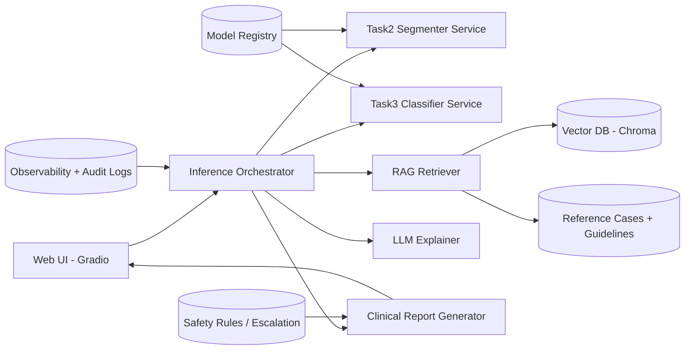
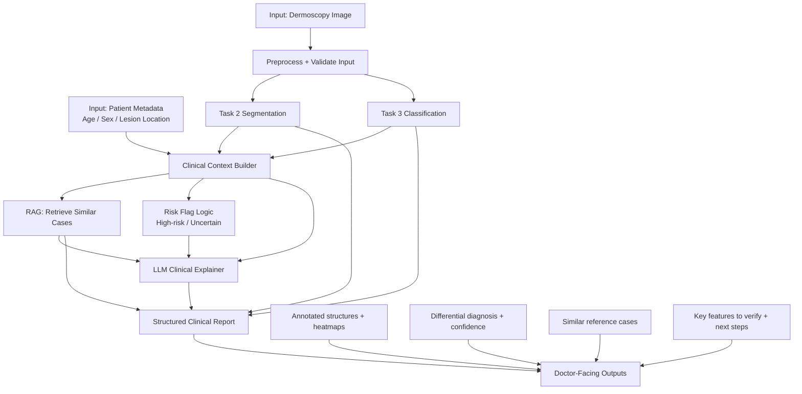

# DermAI Clinical Assistant

Prototype AI-assisted clinical decision support for dermoscopy:
- Task 2: Dermoscopic structure segmentation
- Task 3: Lesion classification (7 classes)
- RAG: Similar reference cases retrieval
- LLM: Clinical interpretation support

## Ideal Architecture (Target)



## End-to-End Clinical Flow (Image + Patient Info)



### How This Supports Doctors

1. Speeds up first-pass review with structure overlays and ranked differential diagnosis.
2. Improves consistency by combining visual features, class probabilities, and reference cases.
3. Surfaces risk signals early (`HIGH RISK`, low-confidence uncertainty, conflicting features).
4. Provides checklist-style guidance on what to verify manually before final decision.
5. Produces a structured report for documentation, communication, and follow-up planning.
6. Keeps clinician in control: this is decision support, not autonomous diagnosis.

## What We Are Building Toward

1. Keep demo simple and runnable (`python app.py`).
2. Support real model inference with plug-and-play checkpoints.
3. Preserve fallback behavior so app never crashes in demo mode.
4. Gradually harden toward production practices (evaluation, safety, monitoring).

## Current Status

- UI pipeline is integrated end-to-end.
- Task2/Task3 currently support:
  - Mock inference (always available)
  - Real inference loading via:
    - TorchScript
    - Serialized `nn.Module`
    - `state_dict` + model factory
- RAG currently uses a small curated reference set for demo.
- LLM explanation supports OpenAI-compatible and Vertex-compatible APIs.

## Real Inference Contract

### Task 2 (Segmentation)
- Input: RGB dermoscopy image
- Output: 5 channels corresponding to:
  - `pigment_network`
  - `negative_network`
  - `streaks`
  - `milia_like_cyst`
  - `globules`
- Expected tensor shape: `[B, C, H, W]` (or compatible dict/tuple containing logits/masks)

### Task 3 (Classification)
- Input: RGB dermoscopy image
- Output: logits/probabilities for 7 classes:
  - `MEL`, `NV`, `BCC`, `AKIEC`, `BKL`, `DF`, `VASC`
- Expected tensor shape: `[B, 7]` (or compatible dict/tuple containing logits)

## Environment Configuration

Create `.env` in repo root:

```env
# LLM
LLM_PROVIDER=vertex
VERTEX_API_KEY=your_key
VERTEX_BASE_URL=https://generativelanguage.googleapis.com/v1beta/openai
VERTEX_MODEL=gemini-2.0-flash

# Optional OpenAI-compatible settings
OPENAI_API_KEY=
OPENAI_BASE_URL=https://api.openai.com/v1
LLM_MODEL=gpt-4o-mini

# Task 2 model
TASK2_MODEL_PATH=weights/task2.pt
TASK2_MODEL_FACTORY=my_models.seg:create_model
TASK2_INPUT_SIZE=256
TASK2_THRESHOLD=0.5

# Task 3 model
TASK3_MODEL_PATH=weights/task3.pt
TASK3_MODEL_FACTORY=my_models.cls:create_model
TASK3_INPUT_SIZE=224
```

Notes:
- If `TASK*_MODEL_PATH` is empty or invalid, app falls back to mock models.
- `TASK*_MODEL_FACTORY` is only needed for `state_dict` checkpoints.

## Run (Demo Mode)

```bash
python3 -m venv .venv
source .venv/bin/activate
pip install -r requirements.txt
python app.py
```

Open: `http://localhost:7860`

If port 7860 is busy, change `server_port` in `app.py` to another port.

## Delivery Plan (Practical Roadmap)

1. **Demo-Ready**
   - Keep current monolithic app.
   - Plug in real weights.
   - Validate outputs and UX flow.

2. **Model Quality**
   - Add eval scripts for Task2/Task3.
   - Report AUROC, sensitivity/specificity, calibration.
   - Tune thresholds for high-risk recall.

3. **Clinical Data Layer**
   - Expand metadata schema (history, evolution, risk factors).
   - Add patient-level split strategy.
   - Improve label quality and provenance tracking.

4. **Safety + Governance**
   - Add explicit escalation rules for uncertain/high-risk outputs.
   - Persist audit logs (input hash, model version, output, timestamp).
   - Add clear traceability and disclaimer policy.

5. **Service Split (Optional Next Stage)**
   - Move Task2/Task3 into separate API services (FastAPI/Triton/KServe).
   - Keep UI + orchestration as independent layer.
   - Add monitoring and autoscaling.

## Definition of Done (for this repo phase)

- App runs locally without manual code edits.
- Real weights can be added through `.env` only.
- Missing weights do not break the app.
- Output format remains stable for UI, RAG, and report generation.
- Clear docs for contributors to plug in models quickly.
